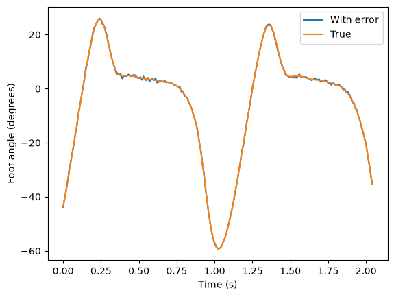

# MoCap-Measurement-Error

A short review of the main sources of measurement error in marker-based optical
motion capture, with worked examples on real data and a focus on soft tissue
artefact, gap filling and filtering.

## Overview

This repository provides a complete walkthrough of measurement error in motion
capture, from instrumental noise to the choice of gap-filling method and
filter. Known errors are added to real marker data, and their effect on a
simple foot angle is measured. The notebook ends with an error budget that
compares all the sources.



## What's Included

- **Example Data**: A sample C3D file (`data/dynamic.c3d`) with marker
  trajectories of a walking trial, from the
  [openOFM](https://github.com/mcgillmotionlab/openOFM) repository (GPL-3.0)
- **Core Functions**: Short Python functions (`utils/error_functions.py`) that
  load the data, add errors, fill gaps, filter and plot
- **Sample Workflow**: Jupyter notebook with a literature review on the sources
  of measurement error, and working examples
- **Visualizations**: Plots showing the effect of each error source on the foot
  angle

## Background

### Marker-based Motion Capture

Optical motion capture systems estimate the 3D position of reflective markers
placed on the skin using several calibrated infrared cameras. Joint angles are
then calculated from the positions of these markers, so any error in the marker
positions can propagate to the final angles. This is most critical for small
segments, such as those of multi-segment foot models like the Oxford Foot Model
(OFM), where markers can be only a few millimeters apart.

### Sources of Measurement Error

The notebook covers five groups of errors:
- Instrumental errors (calibration bias and random noise)
- Marker visibility (gaps, ghost markers and swapped labels)
- Soft tissue artefact (skin movement relative to the bone)
- Anatomical landmark misplacement
- Data processing (gap filling and filtering)

## Getting Started

### Quick Start

Open the Jupyter notebook to view the example workflow (GitHub shows it with
all plots and results saved). The notebook only calls the functions in
`utils/error_functions.py`.

To run it yourself, create the conda environment (it installs Python 3.12 and
all packages) and start Jupyter:

```bash
conda env create -f environment.yml
conda activate edkp616-measurement-error
jupyter lab
```

Then open `EDKP616_Sources_of_Measurement_Error.ipynb` and run all cells. Keep
the `data` and `utils` folders next to the notebook.

Without conda, you need **Python 3.10 or newer** (the `ezc3d` package does not
install on Python 3.9) and a virtual environment:

```bash
python -m venv .venv
source .venv/bin/activate          # Windows: .venv\Scripts\activate
pip install -r requirements.txt
jupyter lab
```

## References

Cappozzo, A., Della Croce, U., Leardini, A., & Chiari, L. (2005). Human
movement analysis using stereophotogrammetry: Part 1: Theoretical background.
Gait & Posture, 21(2), 186–196. https://doi.org/10.1016/j.gaitpost.2004.01.010

Chiari, L., Della Croce, U., Leardini, A., & Cappozzo, A. (2005). Human
movement analysis using stereophotogrammetry: Part 2: Instrumental errors. Gait
& Posture, 21(2), 197–211. https://doi.org/10.1016/j.gaitpost.2004.04.004

Della Croce, U., Leardini, A., Chiari, L., & Cappozzo, A. (2005). Human
movement analysis using stereophotogrammetry: Part 4: Assessment of anatomical
landmark misplacement and its effects on joint kinematics. Gait & Posture,
21(2), 226–237. https://doi.org/10.1016/j.gaitpost.2004.05.003

Dixon, P. C., Drew, E. E., McBride, S. P., Harrington, M., Stebbins, J., &
Zavatsky, A. B. (2025). OpenOFM: An open-source implementation of the
multi-segment Oxford Foot Model. Computer Methods in Biomechanics and
Biomedical Engineering, 1–14. https://doi.org/10.1080/10255842.2024.2448558

Leardini, A., Chiari, L., Della Croce, U., & Cappozzo, A. (2005). Human
movement analysis using stereophotogrammetry: Part 3: Soft tissue artifact
assessment and compensation. Gait & Posture, 21(2), 212–225.
https://doi.org/10.1016/j.gaitpost.2004.05.002

The full reference list is at the end of the notebook.

## Contributing

This is an educational resource. If you find errors, have suggestions for
improvements, or want to add additional examples, please open an issue or
submit a pull request.

## License

This project is released under the [GNU General Public License v3.0](LICENSE).
The sample data file (`data/dynamic.c3d`) comes from
[openOFM](https://github.com/mcgillmotionlab/openOFM), which is also released
under GPL-3.0.
